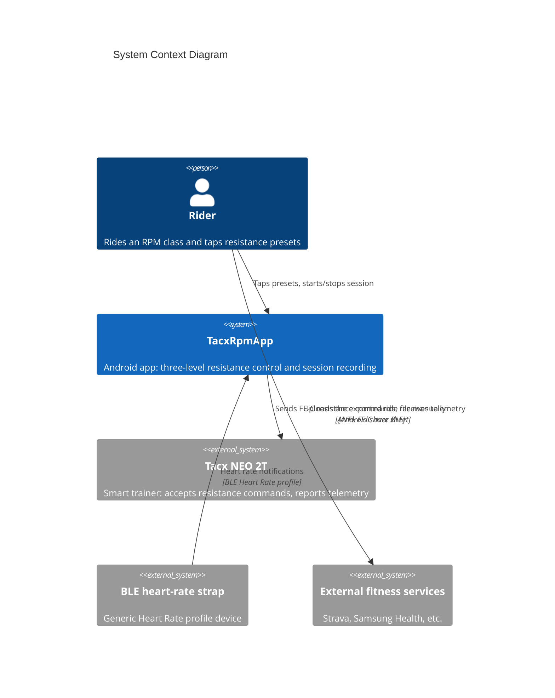

# 3. Context and Scope

<!-- ARC42 §3 — Brief format. Show how the system fits into its environment. -->

## Business Context

The app has **no direct connection to any external service**. Ride files reach Strava or Samsung Health only because the rider shares them, so the app has no network dependency, no accounts and no credentials.

## Technical Context

| Aspect | Detail |
|--------|--------|
| BLE role | Central only. The app connects out to the trainer and the strap; it does not advertise or accept connections. |
| Trainer protocol | ANT+ FE-C messages tunnelled through a proprietary Tacx GATT service. Standard FTMS is discovered but not used for control. |
| Platform binding | Android-specific. `TacxNeoService` and `HeartRateService` use `Android.Bluetooth` types directly and have no cross-platform abstraction. |
| Connection exclusivity | While the app holds the trainer link, other applications generally cannot connect to it. |
| Network | None. |

## External Interfaces

<!-- Summary table — full details in 04-interfaces.md -->

| External System | Protocol | Data Exchanged | Direction |
|----------------|----------|----------------|-----------|
| Tacx NEO 2T | ANT+ FE-C over BLE GATT (`6e40fec1-…`) | Basic-resistance commands out; telemetry and command-status pages in | Bidirectional |
| BLE heart-rate strap | BLE Heart Rate profile (`0x180D` / `0x2A37`) | Heart rate measurement notifications | Inbound |
| Android share sheet | OS intent | Exported ride file | Outbound |
