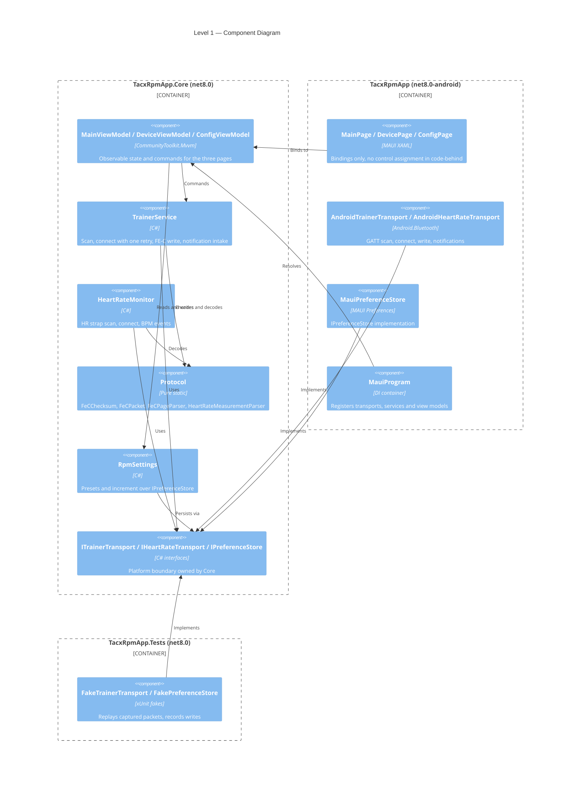

# 5. Building Block View

<!-- ARC42 §5 — Brief format. Level 1 decomposition only. Add levels as needed. -->

## Level 1: System Decomposition

Three projects. `TacxRpmApp.Core` holds every type that does not need Android and owns the BLE boundary as two interfaces. The MAUI app supplies the Android implementations; the test project supplies fakes.

## Component Overview

| Component | Responsibility | Technology | Key Interfaces |
|-----------|---------------|------------|----------------|
| `TrainerService` | Scan, connect (one retry after 700 ms, 12 s timeout, 2 attempts), FE-C basic-resistance write, notification intake, command-status and max-resistance tracking | C#, no Android | `ITrainerTransport` |
| `HeartRateMonitor` | HR strap scan, connect, BPM decoding and events | C#, no Android | `IHeartRateTransport` |
| `Protocol/*` | Pure static encode/decode: XOR checksum, `0x30` basic-resistance builder, pages `0x36`/`0x47`, `0x2A37` measurement | C#, no dependencies | None |
| `RpmSettings` | Presets and increment, clamped, persisted under the original preference keys | C#, `IPreferenceStore` | `IPreferenceStore` |
| `BleDeviceInfo` | Immutable scan result carrying name and MAC address | C# record | None external |
| `MainViewModel` | Preset labels, active-preset state, connect-button state, status text | `CommunityToolkit.Mvvm` | None external |
| `DeviceViewModel` / `ConfigViewModel` | Scan results and connect; edit and validate settings | `CommunityToolkit.Mvvm` | None external |
| `AndroidTrainerTransport` / `AndroidHeartRateTransport` | GATT scan, connect, CCCD subscription, write, raw-packet events | `Android.Bluetooth` | Implements the transport interfaces — see `04-interfaces.md` |
| `MauiPreferenceStore` | Key/value persistence | MAUI `Preferences` | Implements `IPreferenceStore` |
| `MainPage` / `DevicePage` / `ConfigPage` | Layout and bindings only | MAUI XAML | None external |

**Structural observations**

- Core has no Android reference; the whole graph builds and tests on a machine with no Android SDK.
- ViewModels live in `TacxRpmApp.Core/ViewModels`, not in the app project — this deviates from the plan sketched in issue #1 but keeps them unit-testable.
- Every dependency of Core points inward through an interface Core defines; the app and the test project are the only implementors.
- Dependency injection registers all transports, services, view models and pages (`MauiProgram`).
- `HeartRateMonitor` is registered and reachable, but no page binds to it yet.
