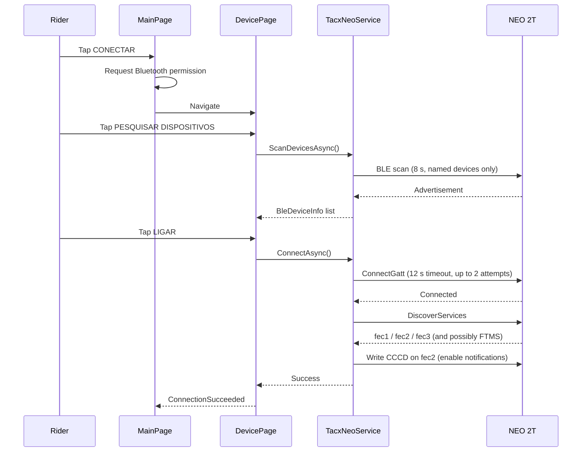
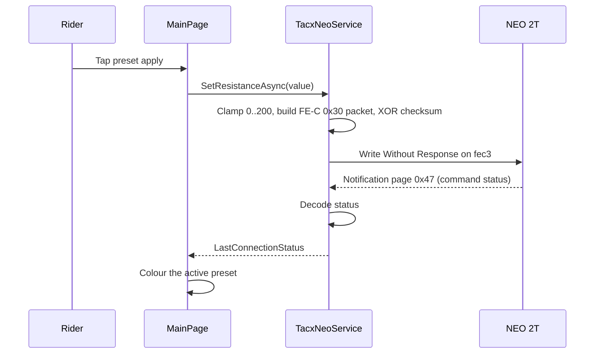
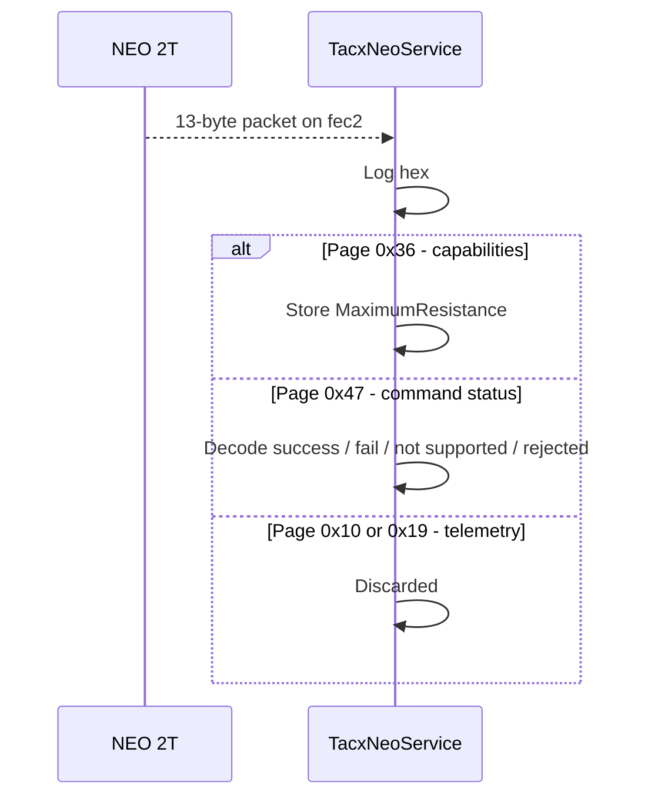

# 6. Runtime View

<!-- ARC42 §6 — Brief format. Document key runtime scenarios as sequence diagrams. -->

## Key Scenarios

| ID | Scenario | Actors | Trigger |
|----|----------|--------|---------|
| RT-1 | Connect to the trainer | Rider, MainPage, DevicePage, TacxNeoService, NEO 2T | Tap **CONECTAR** |
| RT-2 | Apply a resistance preset | Rider, MainPage, TacxNeoService, NEO 2T | Tap a preset apply button |
| RT-3 | Receive an FE-C notification | NEO 2T, TacxNeoService | Continuous, unsolicited, once subscribed |

---

### RT-1: Connect to the trainer

Connection is considered successful when either the FTMS Control Point or the Tacx `fec3` write characteristic is present. Failure surfaces as a Portuguese status string, commonly Android GATT status `133`.

---

### RT-2: Apply a resistance preset

`+`/`-` adjust the stored value and re-send only when that preset is the active one.

---

### RT-3: Receive an FE-C notification

Pages `0x10` (general FE data: speed, distance) and `0x19` (specific trainer data: cadence, instantaneous power) arrive continuously and are currently dropped without being decoded.
