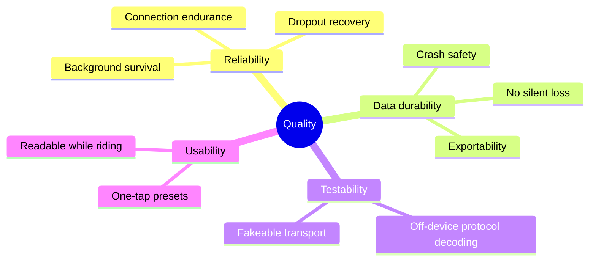

# 10. Quality Requirements

<!-- ARC42 §10 — Brief format. Concrete, measurable quality scenarios. -->

## Quality Tree

## Quality Scenarios

| ID | Quality Goal | Scenario | Priority | Status |
|----|-------------|----------|----------|--------|
| QS-1 | Data durability | A 60-minute session is recorded; the app is killed at minute 40; on relaunch the ride is recoverable with at most one second of data missing | High | **Not Met** — no recording exists |
| QS-2 | Data durability | A completed session produces a file that Strava accepts on upload | High | **Not Met** — no export exists |
| QS-3 | Connection reliability | The trainer link is held for 60 continuous minutes with the screen off | High | **Not Met** — no foreground service |
| QS-4 | Connection reliability | The trainer is briefly powered off mid-session; the app reconnects and continues the same recording | High | **Not Met** — no reconnect path |
| QS-5 | Testability | FE-C page decoding is verified against captured packets without a trainer or phone | Medium | **Not Met** — no test project; parsing is inside Android-typed classes |
| QS-6 | Responsiveness | Tapping a preset changes trainer resistance with no perceptible delay | High | **Met** — verified on hardware; page `0x47` reports `success` |
| QS-7 | Usability | Preset values persist across app restarts | Medium | **Met** — MAUI `Preferences` |
| QS-8 | Data durability | Heart rate is captured alongside trainer data | Medium | **Not Met** — `HeartRateService` is unreferenced |

Status reflects the codebase as of 2026-08-31. Most scenarios are unmet because recording has not been implemented — they are stated here as the target the next work is measured against.
